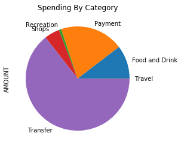
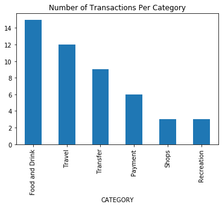
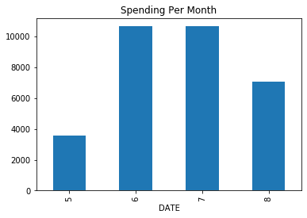
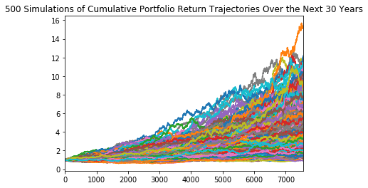
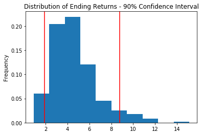
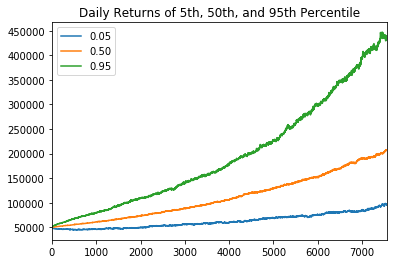

# Harold's Financial Report - 08/28/2019

An analysis of Harold's spending habits as well as a retirement plan. 

## Budget Analysis
Harold's spending seems to far exceed his annual income.  He's currently spending roughly $10k a month versus a monthly income of only $500 a month.
Harold needs to dramatically cut spending as well as get a second job.

### A summary of Harold's income:

Time Period | Income
----------- | -------
Previous Year Gross Income | $7,285
Monthly Income | $500
Projected Gross Income | $7,389
-----------------------
### Spending Per Category:
Harold is transferring quite a bit of money currently.  It is unclear how he accumulated these funds based upon his current annual income.

### Number of Transactions Per Category:
Harold enjoys eating out regularly.  This could be an area that he can make some cuts in spending moving forward.

### Spending by Month:
From the full months records available, Harold is spending roughly $10k per month.

## Retirement Planning
This is a Monte Carlo projection of cumulative returns of a portfolio with 60% allocated to SPY and 40% allocated to AGG over the course of 30 years.

This figure shows the distribution of ending returns for the proposed portfolio within a 90% confidence interval. This portfolio has a range of outcomes from the initial investment growing between 200% to 900%.

The chart below shows the different outcomes at the 10th, 50th, and 90th percentile.

Percentile | Cumulative Returns
-----------|------------------
10th percentile | 2.429149583259581
50th percentile |4.15221305682092
90th percentile |7.242723789423931

The projected value of an inital investment of $50,000 ranges from $121,000 to $362,000.

Percentile | Value
-----------|----------------
10th percentile | $121,457.48
50th percentile | $207,610.65
90th percentile | $362,136.19
----------------------------------
Harold's current projected annual income is $7,389.  Assuming a 4% withdrawal rate in 30 years on a $50,000 inital investment, Harold's projected portfolio would fall short of his income needs.  
------------------------------------------------
Income assuming a 4% withdrawal rate at 10th percentile: $4,858.

A 50% increase in the initial investment ($75,000) would still fall slightly short of Harold's current income.
---------------------------------------------------
Income assuming 4% withdrawal rate with $75k initial investment: $7,287.45

The plot below shows the daily returns of the 5th, 50th, and 95th percentile.  
-----------------------------------------

